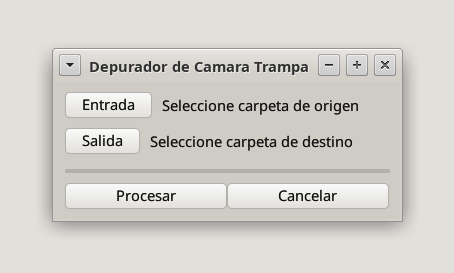
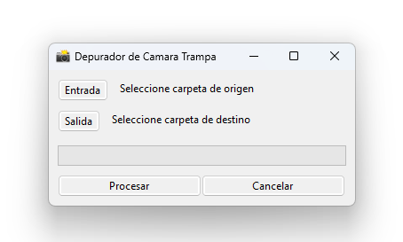

# depuradordecamaratrampa

[](https://github.com/psf/black)

Programa para filtrar las imagenes de cámaras trampa en donde aparezca un animal mediante [Ultralytics YOLO AI](https://github.com/ultralytics/ultralytics) y [ONNX Runtime](https://github.com/microsoft/onnxruntime)

Construido con [Toga](https://github.com/beeware/toga) y [Briefcase](https://github.com/beeware/briefcase)




# Build on Linux

1. Clona este repositorio:
```
git clone https://github.com/antruc/depuradordecamaratrampa.git
cd depuradordecamaratrampa
```
2. Crea un entorno virtual:
```
python3 -m venv env
source env/bin/activate
```
3. Instala las dependencias:
```
pip install briefcase
```
4. Construye la aplicación:
```
briefcase create
briefcase build
briefcase package
```
Y por ultimo instala el programa

Para crear un instalador para otros sistemas operativos se puede seguir el tutorial en la pagina de [BeeWare](https://tutorial.beeware.org/es/latest/tutorial/tutorial-0/)
